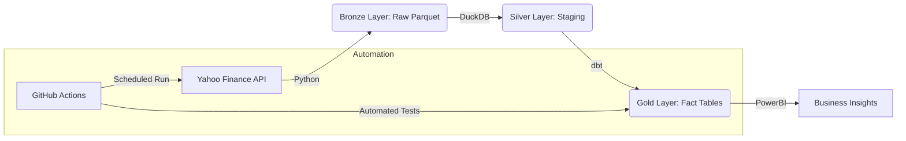

 # News-Driven Market Intelligence Platform

A professional-grade Data Engineering pipeline that automates the collection, transformation, and analysis of global market data. This project demonstrates the **Modern Data Stack** (MDS) architecture and is designed for scalability and data reliability.

# The Architecture

# Tech Stack
*   **Language**: Python 3.11
*   **Orchestration**: GitHub Actions (CI/CD)
*   **Transformation**: dbt (Data Build Tool)
*   **Engine**: DuckDB (Fastest local OLAP)
*   **Storage**: Parquet (Columnar Storage)
*   **Quality**: dbt-test (Data integrity checks)

# Business Impact
This pipeline solves the problem of "Silent Data Corruption." By using **dbt tests**, we ensure that no financial decisions are made on missing or duplicate data. The automated daily runs provide traders with a fresh view of **Daily Stock Performance** every morning.

# How to Run
1.  **Clone the Repo**: `git clone <your-repo-link>`
2.  **Install Dependencies**: `pip install -r requirements.txt`
3.  **Run Extraction**: `python src/fetch_prices.py`
4.  **Run Transformations**: `cd dbt_project && dbt run --profiles-dir ..`
